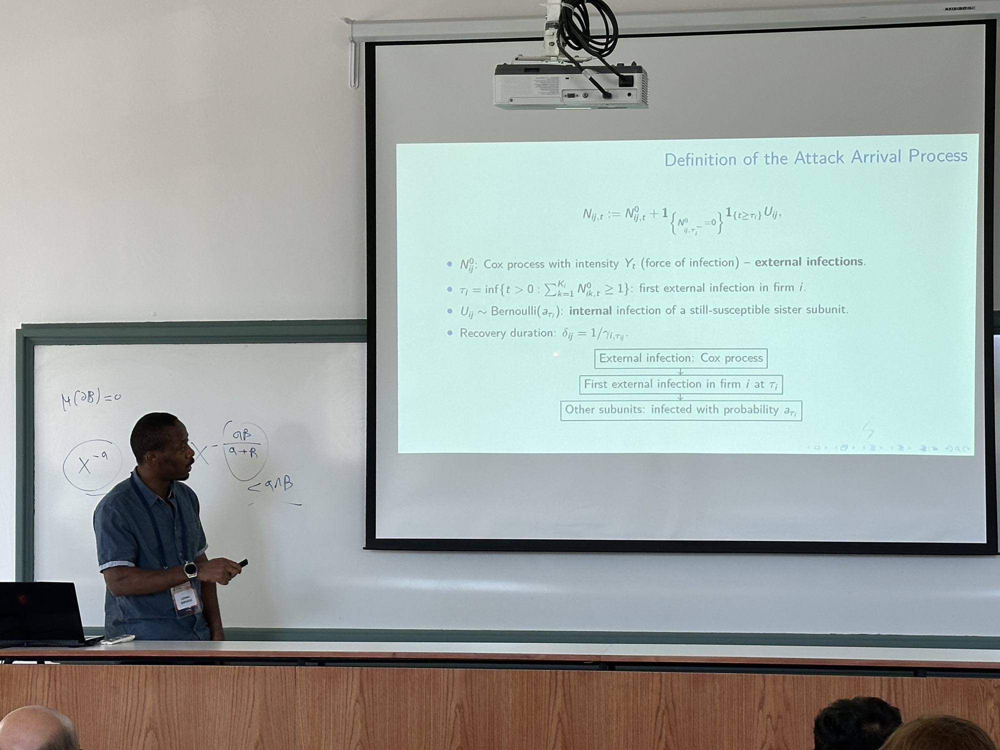

## 👋 About

::: {layout-ncol="2"}

I am Lionel Sopgoui, a Postdoctoral Researcher in Mathematical and Actuarial Finance at ENSAE Paris and the Institut Louis Bachelier. Together with [Prof. Caroline Hillairet](https://sites.google.com/site/carolinehillairet) and [Prof. Olivier Lopez](https://sites.google.com/view/sitepersonneldolivierlopez/home), I apply mathematical tools — such as Hawkes processes, contagion and epidemiological models, and extreme value theory — to model and quantify cyber risks for finance and cyber insurance. Previously, I completed a PhD in Mathematical Finance at [Université Paris Cité](https://www.lpsm.paris/), with research visits at [Imperial College London](https://www.imperial.ac.uk/mathematical-finance/) and work in the Risk division at BPCE S.A. My dissertation focused on applications of probability and stochastic control in economic modelling, climate transition risk, and credit risk. I was co-advised by [Jean-François Chassagneux](https://perso.lpsm.paris/~chassagneux/), [Antoine (Jack) Jacquier](https://jackantoinejacquie.wixsite.com/jacquier), and [Smail Ibbou](https://www.linkedin.com/in/smail-ibbou-31a73b5/).
:::

## 🚧 Ongoing work

- *Real Estate Pricing under Transition Risk: A Real Option Approach*, with Jean-François Chassagneux.
- *A major–minor MFG with common jumps and impulse control for optimal cybersecurity investment*, with Caroline Hillairet.

## 📄 Publications

#### Preprints

**Lionel Sopgoui.** "[Climate-Vulnerable Firms, Credit Supply, and Cascading Failures: An Agent-Based Model](https://papers.ssrn.com/sol3/papers.cfm?abstract_id=6879501)." SSRN.6879501, 2026. *(Submitted to Economic Modelling).* 

**Caroline Hillairet, Olivier Lopez, and Lionel Sopgoui.** "[A stochastic SIR model for cyber contagion: application to granular growth of firms and to insurance portfolio](https://hal.science/hal-05555552v1)." hal-05555552, version 1 (17-03-2026). *(Submitted to Scandinavian Actuarial Journal).* 

**Lionel Sopgoui.** "[Modeling the impact of climate transition on real estate prices](https://arxiv.org/abs/2408.02339/)." arXiv:2408.02339, 2024. *(Submitted to Journal of Climate Finance).* 

#### 2026

#### 2025

**Lionel Sopgoui.** "[Impact of the carbon price on credit portfolio's loss with stochastic collateral](https://doi.org/10.1080/14697688.2025.2577121)." Quantitative Finance, 1–30, 2025.

**Géraldine Bouveret, Jean-François Chassagneux, Smail Ibbou, Antoine Jacquier, Lionel Sopgoui.** "[Propagation of a carbon price in a credit portfolio through macroeconomic factors](https://epubs.siam.org/doi/10.1137/24M1655718)." SIAM Journal on Financial Mathematics, 16(2):545–605, 2025.

#### 2024

**Lionel Sopgoui.** "[PhD thesis: Pricing and hedging of transition risk in Credit Portfolio](https://hal.science/tel-04882729v1)." Université Paris Cité, 2024.

#### 2021

**Lionel Sopgoui.** "[Les essais de Paukémil, l'intrus universel](https://www.bod.fr/librairie/les-essais-de-paukemil-lionel-sopgoui-9782322274079)." *Books on Demand*, 2021.

## 🌍 Talks

#### Upcoming

[**Mathematical Advances on Emerging Risks 2026**](https://thomaspeyrat.github.io/Merida_2026.github.io/index.html), 3–6 November — "A major–minor MFG with common jumps and impulse control for optimal cybersecurity investment." Mexico City, Mexico.

#### 2026

[**7th European Actuarial Journal Conference**](https://www.eaj2026istanbul.org/), 9–11 September — "A stochastic SIR model for cyber contagion: from granular growth of firms to insurance portfolio." Istanbul, Turkey, [Presentation](/files/7th_EAJ_Conference_Sopgoui.pdf).

[**CEMRACS 2026**](https://cemracs2026.math.cnrs.fr/en/) with Dorinel Bastide, Stéphane Crépey, Simone Pavarana, and Ryan Timeus, 20 July–14 August — "Dynamic Top-Down Model for Financial Loss Distribution Under Climate, Credit & Market Risks." CIRM Marseille, France.

[**XIII Bachelier World Congress of the Bachelier Finance Society**](https://eventi.unibo.it/bachelier), 29 June–3 July — "A stochastic SIR model for cyber contagion: from granular growth of firms to insurance portfolio." Bologna, Italy.

[**Scandinavian Actuarial Conference 2026**](https://sites.google.com/view/sac2026/), 15–16 June — "A stochastic SIR model for cyber contagion: from granular growth of firms to insurance portfolio." Stockholm University, Stockholm, Sweden.

[**Financial Risks International Forum 2026**](https://www.risks-forum.org/), 30–31 March — "A stochastic SIR model for cyber contagion: from granular growth of firms to insurance portfolio." Palais Brongniart, Paris, France.

[**XXVII Workshop on Quantitative Finance**](https://qfw2026.unibg.it/), 30–31 March — "A stochastic SIR model for cyber contagion: from granular growth of firms to insurance portfolio." Bergamo, Italy.

#### 2025

[**Quantitative Methods in Finance 2025**](https://qmf2025.exordo.com), 16–19 November — "Impact of the Carbon Price on Credit Portfolio’s Loss with Stochastic Collateral." University of Technology Sydney (UTS), Sydney, Australia, [Presentation](/files/QFM_Sydney_2025.pdf).

[**Séminaire "Actuariat & Finance" - IRA-ISFA-ENSAE-CNAM-ISUP**](https://gains.univ-lemans.fr/fr/actualites/agenda-2025/novembre/e-seminaire-actuariat-finance.html), 21 November — "A stochastic SIRS model for cyber contagion: application to firms' growth and insurance portfolios." Institut du Risque & de l'Assurance, Le Mans, France.

[**SIAM Conference on Financial Mathematics and Engineering (FM25)**](https://www.siam.org/conferences-events/past-event-archive/fm25), 15–18 July — "Modeling the Impact of Climate Transition on Real Estate Prices." Miami, Florida, U.S.

[**EconophysiX seminar**](https://www.econophysix.com/news), 8 April — "A top-down and a bottom-up approach for financial fragility under climate change." Capital Fund Management, Paris, France, [Presentation](/files/CFM_2025.pdf).

[**UCLA - Financial and Actuarial Mathematics Seminar**](https://secure.math.ucla.edu/seminars/display.php?&id=838987), 20 February — "Pricing and hedging of climate transition risk in Credit Portfolio." UCLA (online), [Presentation](/files/UCLA_2025.pdf).

[**London-Oxford-Warwick Financial Mathematics Workshop**](https://sites.google.com/view/london-oxford-warwick-workshop/), 9–10 January — "Modeling the impact of climate transition on real estate prices." University of Oxford, Oxford, England.

#### 2024

[**9th Green Finance Research Advances**](https://green-finance-research-advances-2024.org/), 9–10 December — "Impact of climate transition on credit-portfolio loss with stochastic collateral." Auditorium — Banque de France, Paris, France.

[**Groupe de Travail - Risques Climatiques**](https://www.lpsm.paris/seminaires/gtfinanceprobanumeriques/index), 17 October — "Modeling the impact of climate transition on real estate prices." CACIB, Montrouge, France.

[**12th Bachelier World Congress of the Bachelier Finance Society**](https://eventos.fgv.br/bachelier-2024), 8–12 July — "Propagation of carbon taxes in credit portfolio through macroeconomic factors." FGV EMAp, Rio de Janeiro, Brazil.

[**XXV Workshop on Quantitative Finance**](https://eventi.unibo.it/qfw2024), 11–13 April 2024 — "Impact of climate transition on credit-portfolio loss with stochastic collateral." Università di Bologna, Bologna, Italy.

[**Séminaire Bachelier**](http://www.bachelier-paris.fr/programme/), 9 February — "Impact of climate transition on Loss Given Default with stochastic collaterals." Institut Henri Poincaré, Paris, France.

#### 2023

[**8th Green Finance Research Advances**](https://indico.cern.ch/event/1286716/), 13–14 December — "Propagation of carbon taxes in credit portfolio through macroeconomic factors." Auditorium — Banque de France, Paris, France.

[**European Summer School in Financial Mathematics**](https://www.tudelft.nl/en/events/2023/eemcs/diam/finance-summer-school-2023), 4–8 September — "Propagation of carbon taxes in credit portfolio through macroeconomic factors." Delft University of Technology, Delft, The Netherlands.

[**London/Oxford/Warwick Financial Mathematics Workshop**](https://www.kcl.ac.uk/events/londonoxfordwarwick-financial-mathematics-workshop-1), 12–13 July — "Diffusion of carbon price in credit portfolio through macroeconomic factors." King's College London, London, England, [Presentation](/files/Oxford_London_Warwick_2023.pdf).

<del>[**MathRisk Conference on Numerical Methods in Finance**](https://mathrisk2023.sciencesconf.org/), 14–16 June — "Propagation of carbon tax in credit portfolio through macroeconomic factors." University of Udine, Udine, Italy.</del>

 

<del>[**SIAM Conference on Financial Mathematics and Engineering (FM23)**](https://www.siam.org/conferences/cm/conference/fm23), 6–9 June — "Propagation of carbon tax in credit portfolio through macroeconomic factors." Philadelphia, Pennsylvania, U.S.</del>

 

[**Groupe de travail des thésards du LPSM**](https://www.lpsm.paris/seminaires/gtt/index), 30 May — "Propagation of carbon tax in credit portfolio through macroeconomic factors." Sorbonne Université, Paris, France.

[**Quantitative Finance Workshop 2023**](https://qfw2023.unicas.it/), 20–22 March — "Diffusion of carbon price in credit portfolio through macroeconomic factors." Università di Cassino, Gaeta, Italy.

#### 2022

[**London-Paris Bachelier Workshop (6th edition)**](http://www.bachelier-paris.fr/london-paris-bachelier-workshop/), 15–16 September — "Diffusion of carbon price in a credit portfolio through macroeconomic factors." Institut Henri Poincaré, Paris, France.

## 💡 Teaching

I have worked as a teaching assistant for the following courses:

- **Financial Mathematics at [ENSAE Paris](https://www.ensae.fr/):** first-year master's students — Introduction to financial derivatives, valuation in financial markets, pricing by trees, stochastic calculus, and the Black–Scholes model.

## 🎓 Education

::::: {.d-flex .justify-content-between}
::: {}
**PhD in Mathematical Finance**
[Université Paris Cité / Imperial College London](https://u-paris.fr/)

Advisors: [Jean-François Chassagneux](https://perso.lpsm.paris/~chassagneux/), [Antoine (Jack) Jacquier](https://jackantoinejacquie.wixsite.com/jacquier), and [Smail Ibbou](https://www.linkedin.com/in/smail-ibbou-31a73b5/)
:::

::: text-end
Paris, France
September 2021 – November 2024
:::
:::::

- Thesis: *Pricing and hedging of transition risk in Credit Portfolio.*

::::: {.d-flex .justify-content-between}
::: {}
**M.S. in Financial Mathematics: Statistics and Finance**
[Ecole Polytechnique - ENSAE Paris](http://www.master-statistique-finance.com/IP_Paris/)
:::

::: text-end
Palaiseau, France
September 2019 – December 2020
:::
:::::

- Thesis: *Machine Learning for Finance.*

::::: {.d-flex .justify-content-between}
::: {}
**Engineering Degree in Statistical Modelling and Applications**
[Telecom SudParis](https://www.exeter.ac.uk)
:::

::: text-end
Evry, France
September 2017 – December 2020
:::
:::::

- Thesis: *Machine Learning for Finance.*

::::: {.d-flex .justify-content-between}
::: {}
**BSc in Mathematics and Computer Science**
[National Advanced School of Engineering](https://polytechnique.cm/)
:::

::: text-end
Yaoundé, Cameroon
September 2012 – July 2015
:::
:::::

## 🏆 Projects

- **Trading algorithms on stocks (via IBKR API) and on cryptocurrencies (via Binance API):** building statistical-arbitrage strategies, implementing them in Python, and deploying via Interactive Brokers.

- **Deep and reinforcement learning for Black–Scholes option pricing and hedging:** using modern deep- and reinforcement-learning tools to estimate option values and hedging strategies.

- **Correlation between economic conditions and stock-market performance (Python):** exploratory analyses (linear regression) to study links between market indices (S&P 500) and macroeconomic indicators (inflation, unemployment, interest rates).

- **Statistical inference and ML models on DAX and EURO STOXX futures:** developing machine-learning-based trading strategies.

## 💾 Resume

- [CV](/files/CV_Lionel_Sopgoui.pdf)

## 🎳 Hobbies

- Regular runner and tennis player.
- Writer and philosopher.
- Fan of 🏀 basketball (Golden State Warriors), 🎾 tennis (Novak Djokovic), and 🚴‍♀️ cycling.
- Traveler 🧳.
